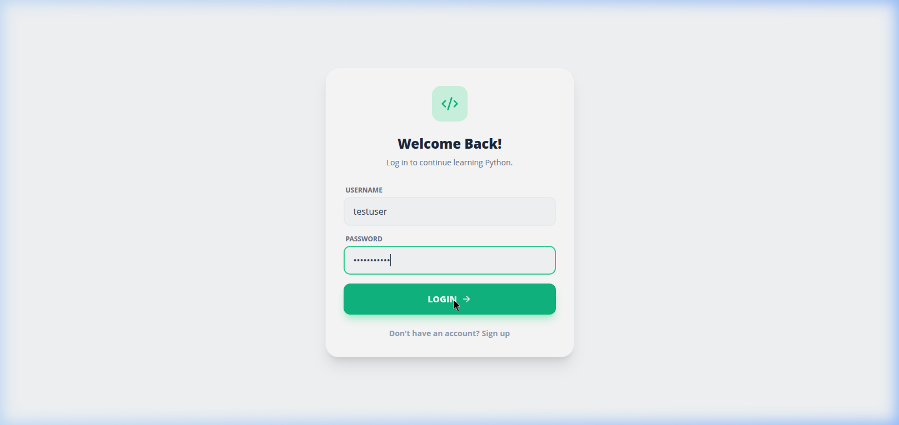
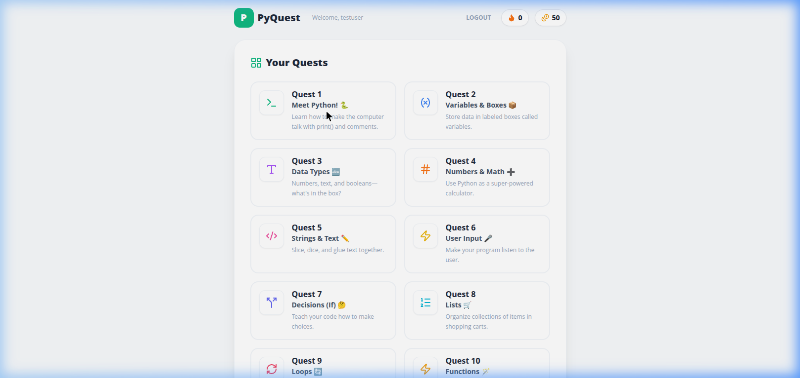
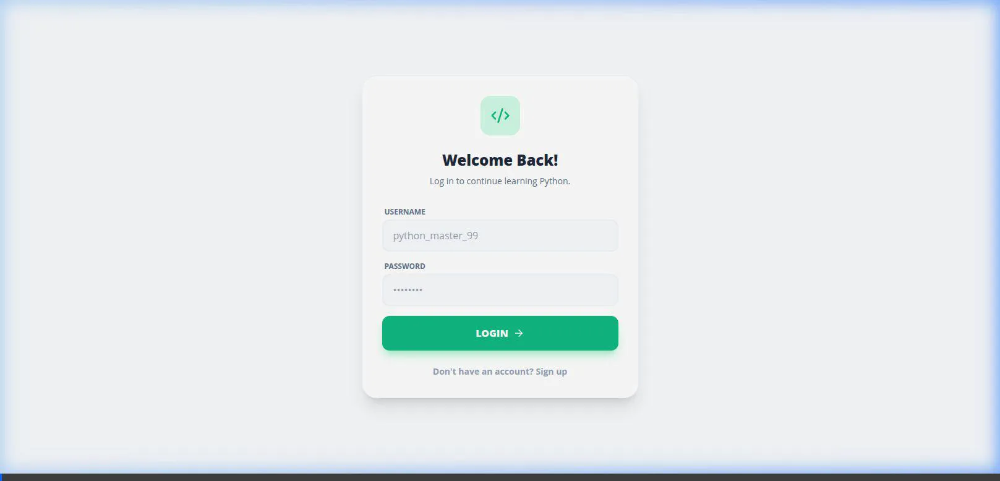
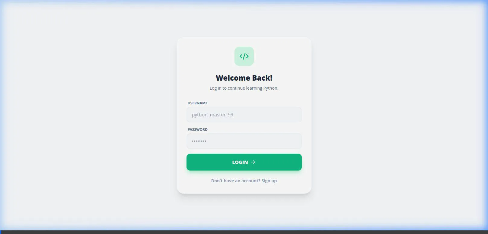

# PyQuest Authentication Integrated successfully!

We've successfully established a full-stack `FastAPI` + `PostgreSQL` implementation to power user accounts and save progress in PyQuest.

### Key Achievements

- **PostgreSQL Database (`docker-compose`)**: Configured a local persistent database container.
- **FastAPI Endpoints**: 
    - Built comprehensive token generation and JWT validation securely hashing with standard `bcrypt`.
    - Handled session progress submission allowing the app to calculate total aggregate coins across multiple sessions.
- **React Frontend Integration**: 
    - Implemented a unified React Context container (`AuthContext`) to cleanly intercept standard HTTP requests.
    - Implemented Dynamic data load bridging JSON metadata to React Component presentation layers.
    - Designed custom responsive Login & Register forms replacing placeholder starting screens.

### Testing Results 

A fully automated browser scenario tested the following successfully:
1. End-To-End user account creation storing password securely within Postgres.
2. Authenticated payload to grant JWT bearer token on frontend.
3. Accessing main app displaying user profile details and previously earned coins dynamically fetched.
4. Completing tests and appending coins back the backend leaderboard.

### Video Walkthroughs

Review these session recordings showing complete user verification testing including form filling and backend sync tracking:
- 
- 
